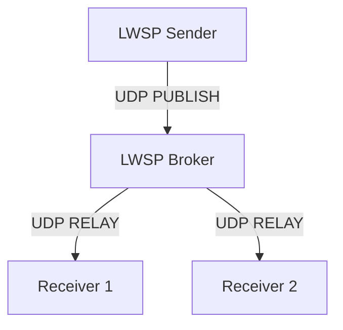

# LWSP — Lightweight Wire Streaming Protocol

[](https://github.com/Srijan0006/lightweight-transfer-protocol/actions)
[](LICENSE)
[](https://www.oracle.com/java/)

**LWSP (Lightweight Wire Streaming Protocol)** is an ultra-low-overhead, UDP-based binary streaming protocol designed for real-time, low-latency, and high-throughput data transfer (such as video streaming, telemetry, or control signals).

Inspired by MQTT's simple pub/sub architecture but tailored specifically for raw UDP performance, LWSP reduces overhead to a minimum—requiring just **4 bytes** for single-packet messages, and **6 bytes** for fragmented frames.

---

## 🚀 Key Features

*   **Minimalist Wire Header**: 
    *   **4 bytes** for single-packet messages.
    *   **6 bytes** for fragmented messages (compared to 20–40+ bytes in TCP/MQTT over TCP).
*   **Automatic Reassembly**: Large payloads (e.g., JPEG screen frames) are automatically fragmented at the sender's MTU and reassembled at the receiver.
*   **Receiver-Side TTL Eviction**: Incomplete messages are evicted if reassembly times out (configured in 200 ms increments) to protect the receiver from resource leaks.
*   **Secure Control Plane**: Session control packets (`HELLO`, `WELCOME`, `PING`, `PONG`, `SUBSCRIBE`) can be encrypted using **AES-GCM-128** with a shared secret.
*   **MQTT-Like Semantics**:
    *   **Topic Filtering**: Compact 3-bit topic IDs on the wire, mapped to locally resolved topic names.
    *   **Retain Flags**: The receiver stores and immediately displays the last received message for late-joiners.
*   **Broker Relay Mode**: Run in peer-to-peer (direct) mode, or route streams through an LWSP Broker to fan out to multiple subscribers.

---

## 📊 Wire Protocol Specification

### Header Layout

LWSP achieves its small footprint by packing all protocol flags and headers tightly:

#### 1. Single-Packet Message (4-Byte Header + Payload)
```text
 0                   1                   2                   3
 0 1 2 3 4 5 6 7 8 9 0 1 2 3 4 5 6 7 8 9 0 1 2 3 4 5 6 7 8 9 0 1
+-+-+-+-+-+-+-+-+-+-+-+-+-+-+-+-+-+-+-+-+-+-+-+-+-+-+-+-+-+-+-+-+
|  Ver  |  Type |M|F|  TTL  | Topic |R|            Msg ID     |
+-+-+-+-+-+-+-+-+-+-+-+-+-+-+-+-+-+-+-+-+-+-+-+-+-+-+-+-+-+-+-+-+
|                      Payload Bytes ...                        |
+---------------------------------------------------------------+
```

#### 2. Fragmented Message (6-Byte Header + Payload)
Identical to the single-packet header, but with `frag_msg (F)` set to `1` to append fragmentation metadata at bytes 4–5:
```text
 0                   1                   2                   3
 0 1 2 3 4 5 6 7 8 9 0 1 2 3 4 5 6 7 8 9 0 1 2 3 4 5 6 7 8 9 0 1
+-+-+-+-+-+-+-+-+-+-+-+-+-+-+-+-+-+-+-+-+-+-+-+-+-+-+-+-+-+-+-+-+
|  Ver  |  Type |M|F|  TTL  | Topic |R|            Msg ID     |
+-+-+-+-+-+-+-+-+-+-+-+-+-+-+-+-+-+-+-+-+-+-+-+-+-+-+-+-+-+-+-+-+
|  Frag Index   |  Total Frags  |       Payload Bytes ...       |
+-+-+-+-+-+-+-+-+-+-+-+-+-+-+-+-+-------------------------------+
```

### Fields Guide

| Field | Bits | Description |
|---|---|---|
| **Ver** | 2 | Protocol Version (currently `0`). |
| **Type** | 4 | Message type (e.g., PUBLISH, HELLO, SUBSCRIBE). |
| **more_frags (M)** | 1 | Set if more fragments for this `msg_id` are on the way. |
| **frag_msg (F)** | 1 | Set if this packet contains fragmentation details (enables Bytes 4-5). |
| **TTL** | 4 | Max reassembly age on receiver. Calculated in 200 ms units (e.g. `5` = 1 second). `0` = no limit. |
| **Topic ID** | 3 | Compact 3-bit channel identification (IDs 0–7). Topic strings are not sent over the wire. |
| **Retain (R)** | 1 | Directs the receiver or broker to cache the last payload on this topic. |
| **Msg ID** | 16 | Message correlation ID. Used to group fragments together and perform deduplication. |
| **Frag Index** | 8 | 0-based index of the current fragment. |
| **Total Frags** | 8 | Total count of fragments composing the complete message. |

### Message Types

| Value | Name | Description |
|---|---|---|
| `1` | `PUBLISH` | Unicast or multicast data payload. |
| `2` | `SUBSCRIBE` | Sent by receivers to register interest in specific topic IDs. |
| `3` | `PING` | Liveness heartbeat check. |
| `4` | `PONG` | Heartbeat acknowledgement. |
| `5` | `HELLO` | Pre-session handshake initialization. |
| `6` | `WELCOME` | Server/Receiver acknowledgement of readiness. |

---

## 🛠️ Project Structure

The project code is located in the [`src/lwsp`](src/lwsp) directory:

*   [`LWSPPacket.java`](src/lwsp/LWSPPacket.java): Handles parsing, serialization, and deserialization of the binary headers.
*   [`LWSPCrypto.java`](src/lwsp/LWSPCrypto.java): Provides optional AES-GCM (128-bit) symmetric encryption for all control packets.
*   [`LWSPWire.java`](src/lwsp/LWSPWire.java): Utility classes to bind packet encoding/decoding with encryption routines.
*   [`LWSPTopics.java`](src/lwsp/LWSPTopics.java): Mapped list of static topics (e.g., `SCREEN`, `TELEMETRY`, `CONTROL`) and receiver subscription filters.
*   [`Sender.java`](src/lwsp/Sender.java): Captures desktop segments at ~20 FPS, packages them as JPEG payloads, and streams them.
*   [`Receiver.java`](src/lwsp/Receiver.java): Reassembles frame fragments, enforces TTL timeouts, handles retain states, and renders the JPEG video using Java Swing.
*   [`Broker.java`](src/lwsp/Broker.java): Relays UDP streams between publishing senders and subscribed receivers.

---

## 🏃 Getting Started & Running Demos

### 1. Build the Code
To compile all LWSP Java source files into the `out` directory:
```bash
javac -d out src/lwsp/*.java
```

---

### 💻 Demo 1: Direct Streaming (P2P Mode)

In this mode, the `Sender` captures your screen (a `600x600px` region in the top-left corner) and streams it directly to the `Receiver`.

#### Step A: Start the Receiver
```bash
java -cp out lwsp.Receiver
```
A Java Swing window will open, ready to render incoming frames.

#### Step B: Start the Sender
Open another terminal and start the sender:
```bash
# Defaults to localhost (127.0.0.1)
java -cp out lwsp.Sender

# Or specify a target receiver IP address:
java -cp out lwsp.Sender 192.168.1.50
```
*You will immediately see your screen streamed into the Swing window at ~20 FPS.*

---

### 🌐 Demo 2: Broker Relay Mode

Using Broker mode allows multiple receivers to subscribe to a single sender's stream.



#### Step A: Launch the Broker
```bash
java -cp out lwsp.Broker
```

#### Step B: Start Multiple Receivers
Open multiple terminals (or run on multiple devices) pointing to the Broker's IP:
```bash
java -cp out lwsp.Receiver 127.0.0.1
```

#### Step C: Start the Sender
Point the sender to the Broker:
```bash
java -cp out lwsp.Sender 127.0.0.1
```
*All active receiver windows will immediately display the live screen capture feed simultaneously.*

---

### 🔒 Demo 3: Secure Streaming (AES-GCM Encryption)

By setting the `LWSP_SECRET` environment variable or passing the key via the CLI, you can protect control plane packets (e.g. `HELLO`, `WELCOME`, `SUBSCRIBE`) from unauthorized snooping or hijacking.

#### 1. Set the Secret Env Variable (All platforms)
*   **Windows (CMD)**:
    ```cmd
    set LWSP_SECRET=my-super-secure-key
    ```
*   **Windows (PowerShell)**:
    ```powershell
    $env:LWSP_SECRET="my-super-secure-key"
    ```
*   **Linux / macOS**:
    ```bash
    export LWSP_SECRET="my-super-secure-key"
    ```

#### 2. Run with the Encryption Secret (Or pass as arguments)
If you prefer not to use environment variables, pass the secret as the final CLI argument:

**Broker Mode with Encrypted Handshakes:**
```bash
# 1. Start Broker with secret
java -cp out lwsp.Broker my-super-secure-key

# 2. Start Receiver connecting to Broker with secret
java -cp out lwsp.Receiver 127.0.0.1 my-super-secure-key

# 3. Start Sender connecting to Broker with secret
java -cp out lwsp.Sender 127.0.0.1 my-super-secure-key
```

---

## 🛠️ Configuration & Customization

You can tweak several parameters directly in the source code files:
*   **Frame Rate**: Adjust `FPS` (default: `20`) in [`Sender.java`](src/lwsp/Sender.java) to modify speed.
*   **MTU Size**: Adjust `MTU` (default: `1400`) in [`Sender.java`](src/lwsp/Sender.java) to match your network path MTU.
*   **Eviction Timer**: Adjust `TTL_UNIT_MS` (default: `200L`) in [`LWSPPacket.java`](src/lwsp/LWSPPacket.java) to shorten/extend frame timeouts on lossy links.

## 📜 License
This project is open-source and licensed under the MIT License. See [LICENSE](LICENSE) for more details.
